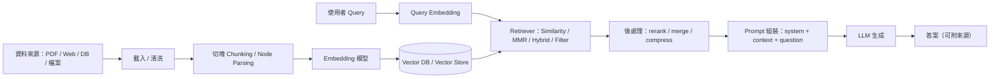

# RAG 架構說明

## 摘要

RAG（Retrieval-Augmented Generation，檢索增強生成）把「外部知識檢索」與「LLM 生成」拆成兩段式：先把文件切塊後做嵌入（Embedding）並寫入向量資料庫（Vector DB / Vector Store），在查詢時再把使用者問題嵌入後做相似度檢索，把最相關的片段放進提示詞（Prompt），再交給模型生成答案。

LangChain 與 LlamaIndex 都能完整落地這條流程，但偏重不同：LangChain 更像「工作流／組裝層」，強在 chains、agents、streaming 與多元整合；LlamaIndex 更像「資料索引與檢索層」，強在 Nodes、Ingestion Pipeline、Query Engine、Response Synthesizer 與向量庫整合。

如果你要把 RAG 嵌進更大的代理、多工具或事件流系統，LangChain 通常更順手；如果你要把重心放在「資料攝取、索引、檢索策略與回答合成」，LlamaIndex 往往更直接。

## RAG 核心工作流程

RAG 可以分成兩個時間面：

1. **Indexing（離線／背景）**：載入資料、清洗、切塊、做 embedding，最後寫入向量庫。  
2. **Retrieval + Generation（線上查詢）**：把使用者問題轉成向量，從向量庫找出相似片段，再把片段連同問題一起交給 LLM 生成答案。

Embedding 會把文字映射成高維向量；向量庫則根據向量相似度，找出語意最接近的文字片段。這樣模型不是只靠「記憶」，而是先拿到外部證據再回答，因此能降低幻覺、提高可追溯性。

## LangChain 實作重點

LangChain 的核心鏈路通常是：

**Embeddings → VectorStore → Retriever → Chain / Agent → LLM**

它的特色是把這些步驟抽象成可組裝元件。實務上常見做法是：

- 用 embeddings 把 chunk 轉成向量
- 寫入 Chroma、FAISS、Pinecone 等向量庫
- 透過 `as_retriever()` 轉成 retriever
- 再接到 chain 或 agent 做回答

LangChain 官方文件也把 RAG 分成兩類：

- **RAG agent**：模型可自行決定何時呼叫檢索工具，彈性高，但成本與延遲通常較高
- **Two-step RAG chain**：固定先檢索再生成，只打一輪模型，速度較快、流程較穩定

此外，LangChain 也提供 streaming 與 embedding cache，適合要做完整產品化流程的情境。

## LlamaIndex 實作重點

LlamaIndex 的思路更偏「資料中心」：

**Documents → Nodes → Index → Retriever / Query Engine → Response Synthesizer**

它的重點不只是在「能查到」，而是在「如何把資料變成適合查詢的索引」。實務上你會常看到：

- `VectorStoreIndex`：最常用的向量索引
- `IngestionPipeline`：把切塊、metadata、embedding、寫入向量庫串成可重複流程
- `QueryEngine`：把檢索與回答合成包在一起
- `Response Modes`：控制多 chunk 如何合成最終答案，例如 refine、compact

LlamaIndex 在資料 ingest、索引建構、cache 與檢索調參上通常更直觀，特別適合把 RAG 當成主體系統來優化。

## LangChain 與 LlamaIndex 的差異

| 面向 | LangChain | LlamaIndex |
|---|---|---|
| 核心定位 | 工作流／代理／工具組裝 | 資料索引／檢索／回答合成 |
| RAG 風格 | 適合嵌入多工具、多步驟系統 | 適合以資料查詢為中心的系統 |
| 抽象單位 | Chains、Agents、Runnables、Tools | Nodes、Indexes、Retrievers、Query Engines |
| 強項 | orchestration、streaming、整合豐富 | ingestion、indexing、retrieval 調參清楚 |
| 常見使用情境 | 複雜 AI workflow、Agent 系統 | 文件問答、知識庫、資料導向 RAG |

## 結論

兩者都能完成 **Embedding → Vector DB → Retrieval → Generation** 的標準 RAG 流程，但強項不同：

- **LangChain**：更適合把 RAG 當成整體 AI 系統中的一個模組
- **LlamaIndex**：更適合把資料索引、檢索品質與回答合成當成核心優化目標

所以不是誰比較好，而是你要優先解決的是「流程編排問題」，還是「資料檢索問題」。

## 參考文獻

1. LangChain Docs, **Build a RAG agent with LangChain**  
   https://docs.langchain.com/oss/python/langchain/rag

2. LangChain Docs, **Chroma integration**  
   https://python.langchain.com/docs/integrations/vectorstores/chroma/

3. LangChain Docs, **Streaming**  
   https://docs.langchain.com/oss/python/langchain/streaming

4. LlamaIndex Docs, **Vector Stores**  
   https://docs.llamaindex.ai/en/stable/module_guides/storing/vector_stores/

5. LlamaIndex Docs, **Using VectorStoreIndex**  
   https://docs.llamaindex.ai/en/stable/module_guides/indexing/vector_store_index/

6. LlamaIndex Docs, **Ingestion Pipeline**  
   https://docs.llamaindex.ai/en/stable/module_guides/loading/ingestion_pipeline/

7. LlamaIndex Docs, **Query Engine**  
   https://docs.llamaindex.ai/en/stable/module_guides/deploying/query_engine/

8. LlamaIndex GitHub Repository  
   https://github.com/run-llama/llama_index
