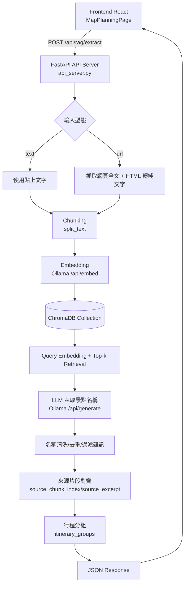

# 日本旅遊規劃專案：RAG 架構說明（完整版）

## 1. 架構目標
本專案的 RAG（Retrieval-Augmented Generation）目標是：

- 輸入旅遊攻略文字或攻略 URL
- 自動萃取景點名稱
- 回傳每個景點的來源片段（可解釋性）
- 進一步支援行程分組與前端地圖展示

核心設計重點是「可 demo、可追蹤來源、可逐步擴充到 production」。

---

## 2. 系統總覽架構圖



---

## 3. 元件與職責分工

### 3.1 Frontend（React）
- 檔案：
  - `src/pages/MapPlanningPage.jsx`
  - `src/components/map/GoogleMapPanel.jsx`
- 職責：
  - 收集 `text/url` 輸入
  - 呼叫 `/api/rag/extract`
  - 顯示景點卡片、來源片段、分組結果
  - 將結果同步到地圖與行程列表

### 3.2 API 層（FastAPI）
- 檔案：`backend/rag_prototype/api_server.py`
- 主要端點：
  - `GET /health`
  - `POST /api/rag/extract`
- 職責：
  - 輸入驗證（text/url）
  - URL 網頁全文擷取與清理
  - 呼叫 RAG pipeline
  - 後處理（景點清洗、來源對齊、分組）
  - 回傳前端可直接使用的 JSON

### 3.3 RAG Pipeline（Ollama + ChromaDB）
- 檔案：`backend/rag_prototype/rag_week2.py`
- 職責：
  - 文字切塊（chunking）
  - embedding 向量化
  - 向量索引與檢索
  - LLM 萃取景點名稱
  - fallback 策略（embedding/generation 失敗時）

---

## 4. 核心資料流（Step-by-Step）

### Step 1：輸入來源整備
- `text` 直接使用使用者貼上的內容
- `url` 先經 `fetch_guide_text_from_url()`：
  - 抓 HTML
  - 移除 script/style/noscript
  - 保留段落/標題換行結構
  - 盡量保留 Day1/Day2 等行程分段線索

### Step 2：Chunking
- 使用 `split_text()` 進行語意切塊
- 考量：
  - chunk_size / overlap
  - heading 優先（例如 Day 標題）
  - 避免過短碎片

### Step 3：Embedding + 向量索引
- 使用 Ollama embedding 模型（預設 `nomic-embed-text`）
- 寫入 ChromaDB collection
- 目前已修正「舊資料污染」問題：每次新請求前清除既有 ids，再寫入本次 chunks

### Step 4：Retrieval
- 對 `query` 做 query embedding
- 在 ChromaDB 做 top-k 檢索，取回相關 chunks
- URL 模式可設定更高 top-k 或全文閱讀模式

### Step 5：Generation（景點萃取）
- 以檢索內容組 prompt
- 呼叫 Ollama generation 模型萃取景點名單
- 若模型輸出不穩定，使用 regex fallback 擷取候選名稱

### Step 6：後處理（品質關鍵）
- 名稱 canonicalization、去重、雜訊過濾
- 找出每個景點對應的來源 chunk 與 excerpt
- 推估評論數等示範欄位
- 依段落/Day 標題做 itinerary groups 分組

### Step 7：回傳前端
- 回傳欄位包含：
  - `spot_names`
  - `spots[]`（含 `source_chunk_index`, `source_excerpt`, `source_text`）
  - `itinerary_groups[]`
  - `embed_model`, `gen_model`, `generation_warning`
  - `debug_metrics`, `debug_samples`

---

## 5. API 回傳資料結構（重點）

```json
{
  "provider": "ollama",
  "input_source": "text|url",
  "spot_names": ["淺草寺", "雷門"],
  "spots": [
    {
      "name": "淺草寺",
      "source_chunk_index": 3,
      "source_excerpt": "......",
      "source_text": "......",
      "xai": "此景點來源：攻略文章第3段",
      "reviews_count": 128,
      "is_data_insufficient": false
    }
  ],
  "itinerary_groups": [
    {
      "group_id": "group-1",
      "title": "DAY1",
      "spot_names": ["淺草寺", "雷門"],
      "spot_count": 2
    }
  ]
}
```

---

## 6. 容錯與降級策略（Fallback）

### 6.1 Embedding 模型 fallback
- 依候選清單嘗試多個 embedding 模型
- 若全部失敗，降級為非向量模式（直接用 chunks 做抽取）

### 6.2 Generation 模型 fallback
- 依候選清單嘗試多個 generation 模型
- 若模型失敗，退回規則式擷取（regex-based）

### 6.3 路線規劃與地圖展示分離
- RAG 成果與地圖路線 API 解耦
- 即使 Directions API 被拒絕，仍可用 Google Maps URL fallback 導航，確保 demo 可運作

---

## 7. 現況優勢與限制

### 優勢
- 能處理 text 與 URL 兩種輸入
- 有來源片段可追溯（XAI）
- 具備多層 fallback，穩定度高於單一路徑
- 前後端已完整串接，可直接 demo

### 限制
- 網站結構差異大時，純 HTML parsing 仍可能抓到噪音
- 景點標準化與地理正規化仍有提升空間
- 分組邏輯目前偏規則式，跨網站泛化能力有限

---

## 8. 下一步優化建議（Week 4+）

1. 加入「景點地理正規化層」
- 萃取名稱後，透過 geocoding/place search 取得可信座標與 place_id
- 避免 fallback 假座標影響導航品質

2. 分離「抽取」與「分組」兩階段模型
- 第 1 階段只做 spot extraction
- 第 2 階段做 itinerary clustering/grouping

3. 建立評測集與指標
- Spot Precision / Recall
- Source Attribution Accuracy
- Grouping Coherence

4. 加入快取與增量索引
- URL 重複請求時可重用清洗與 chunk 結果
- 降低延遲與 Ollama 負載

---

## 9. 專案內對應檔案索引

- RAG API 入口：`backend/rag_prototype/api_server.py`
- RAG 核心流程：`backend/rag_prototype/rag_week2.py`
- 前端頁面：`src/pages/MapPlanningPage.jsx`
- 地圖元件：`src/components/map/GoogleMapPanel.jsx`

此文件可直接作為報告中「RAG 架構段落」主體，再依週次加入實驗數據與截圖即可。

