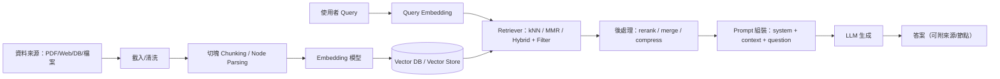

# RAG 架構說明

## 摘要

RAG（Retrieval‑Augmented Generation，檢索增強生成）把「外部知識檢索」與「LLM 生成」拆成兩段式：先把文件切塊後做嵌入（Embedding）並寫入向量資料庫（Vector DB / Vector Store），在查詢時再把使用者問題嵌入後做相似度檢索，把最相關的片段塞回提示詞（Prompt）讓模型生成答案。

LangChain 與 LlamaIndex 都能完整落地上述流程，但偏好不同：LangChain 更像「工作流/組裝層」（chains/agents、Runnable/streaming、整合豐富），而 LlamaIndex 更像「資料索引與檢索層」（Nodes、Ingestion Pipeline、Query Engine、Response Synthesizer、向量庫特性矩陣）。

選型上，如果你要把「RAG 只是其中一段」嵌進更大的工具/代理/流程（含多步推理、事件串流、可觀測性），LangChain 通常更順手；如果你要把重心押在「資料攝取、索引、檢索策略與回應合成」並做細緻調參，LlamaIndex 往往更直接。以下用同一條 RAG 主線（Embedding → Vector DB → Retrieval → Generation）拆解技術細節並對照兩者取捨。

## RAG 核心工作流程

RAG 可以分成兩個時間面：離線/背景的 Indexing（把資料變成可檢索的向量與索引），以及線上的 Retrieval & Generation（把問題轉成向量去找 context，再交給 LLM 回答）。LangChain 官方教學也用「Indexing」與「Retrieval and generation」來拆解，並提供「agentic RAG」與「兩段式（固定檢索→一次生成）」兩種常見形態。



關鍵「第一性原理」：Embedding 把文字映射成高維向量，向量庫用相似度（多以 ANN/近似最近鄰為主）在向量空間中找「語意接近」的片段，再把片段當作條件/證據提供給模型，降低直接靠模型「背誦」或「幻想補齊」的機率。向量庫介面通常至少提供寫入（add/upsert）、刪除、相似度查詢等能力；LangChain 也把這些抽象成統一介面以便替換不同後端。

工程上最常決定品質/成本的旋鈕通常在這幾個點：切塊策略（chunk size/overlap、以句子/Token 切、是否保留章節結構）、metadata 設計（租戶/權限/文件版本/時間）、檢索策略（top‑k、MMR、多路檢索、hybrid、filter）、後處理（rerank、contextual compression、合併大段落），以及生成端的 context 格式化（加 delimiter、防 prompt injection、來源引用）。LangChain 官方 RAG 教學特別提醒「檢索內容與 system prompt 共用同一 context window」會引入間接提示注入（indirect prompt injection），因此建議明確要求模型把檢索內容當資料、不要執行其中指令，並用清楚分隔符包起來。

## LangChain 實作重點與技術細節

LangChain 在 RAG 上的核心抽象鏈路通常是：Embeddings → VectorStore → Retriever →（Chain/Agent）→ LLM。以 Chroma 整合文件為例，官方文件明確示範用 `langchain-chroma`、`OpenAIEmbeddings(model="text-embedding-3-large")` 建立向量庫、`add_documents` 寫入、再用 `as_retriever` 把向量庫「鑄型」成 Retriever，並支援 `search_type="mmr"`、`search_kwargs`、metadata filter 等；這讓 RAG 上線時最常用到的「top‑k + 多樣性（MMR）+ 條件過濾」具體可調。

在「檢索→生成」的組裝方式上，LangChain 官方 RAG 教學把常見形態分成兩類：  
一類是 agentic RAG：讓模型自行決定何時呼叫「retrieve_context」這類工具（必要時可連續多次檢索），換取彈性但可能增加推論次數與控制難度；另一類是固定兩段式 chain：每次都先檢索，再把檢索結果塞進同一次模型呼叫以降低延遲，但犧牲「不需要查就別查」的彈性。

效能與成本面，LangChain 提供 embedding 快取的官方路徑：`CacheBackedEmbeddings` 會把文字雜湊後用 key‑value store 快取 embedding，避免重複計算（常見於重建索引或多次 ingest）

串流面，LangChain 官方將 streaming 定義為「即時輸出更新」，用於降低 LLM 延遲的體感，且其 Runnable 生態系統可用 `.stream()`/`.astream()` 逐步產出結果。

### LangChain 範例（Embedding → 向量庫 Upsert → Retrieval → Generation）

```python
# pip install -U langchain langchain-openai "langchain-chroma>=0.1.2" chromadb
import os
from langchain_openai import OpenAIEmbeddings, ChatOpenAI
from langchain_chroma import Chroma
from langchain_core.documents import Document
from langchain_core.prompts import ChatPromptTemplate
from langchain_core.output_parsers import StrOutputParser
from langchain_core.runnables import RunnablePassthrough

os.environ["OPENAI_API_KEY"] = os.getenv("OPENAI_API_KEY", "YOUR_KEY")

# 1) Embedding
emb = OpenAIEmbeddings(model="text-embedding-3-large")

# 2) Vector DB / Vector Store（示範用 Chroma；persist_directory 可換成你要的路徑）
vs = Chroma(
    collection_name="rag_demo",
    embedding_function=emb,
    persist_directory="./chroma_db",
)

# Upsert（LangChain 以 add_documents 寫入；指定 id 後可更新/刪除更好控）
docs = [
    Document(page_content="RAG = retrieval + generation。", metadata={"source": "note"}, id="d1"),
    Document(page_content="MMR 會在相關性與多樣性間取平衡。", metadata={"source": "note"}, id="d2"),
]
vs.add_documents(docs)

# 3) Retrieval（MMR + top-k；fetch_k 通常設更大以便 MMR 做去重/多樣化）
retriever = vs.as_retriever(search_type="mmr", search_kwargs={"k": 2, "fetch_k": 10})

def format_docs(docs_):
    return "\n\n".join(f"[{d.metadata.get('source','')}] {d.page_content}" for d in docs_)

# 4) Retrieval -> Generation（LCEL：把 retriever 結果映射成 context 丟進 prompt）
prompt = ChatPromptTemplate.from_messages([
    ("system",
     "你是工程師助手。只使用 <context> 內資訊回答；若不足，回答「我不知道」。\n"
     "<context>\n{context}\n</context>"),
    ("human", "{question}"),
])

llm = ChatOpenAI(model="gpt-5-mini", temperature=0)  # 模型名請換成你帳號可用的
rag = (
    {"context": retriever | format_docs, "question": RunnablePassthrough()}
    | prompt
    | llm
    | StrOutputParser()
)

print(rag.invoke("RAG 是什麼？它的兩段式流程是？"))
```

## LlamaIndex 實作重點與技術細節

LlamaIndex 的 RAG 思維通常更「資料中心」：先把文件變成 Nodes（切塊/結構化後的最小檢索單位），再用 Index（如 `VectorStoreIndex`）把 Nodes 與向量庫銜接；查詢時由 Retriever 取回相關 Nodes，Query Engine 負責把「檢索 + 回答合成」組起來。官方文件對 Retriever 與 Query Engine 的定位很直接：Retriever 專注「取回最相關 context」，Query Engine 則是把自然語言 query 變成「檢索後的豐富回應」，通常建立在一或多個 index/retriever 之上。

向量庫整合方面，LlamaIndex 官方文件明確指出向量庫存的是「文件 chunk 的 embedding 向量（有時也存 chunk 本身）」；並提供「20+ vector store options」與功能矩陣（metadata filtering、hybrid search、delete、async…），這對工程選型（要不要 hybrid、要不要 filter、要不要 async、要不要把原文存回向量庫）很有用。

Indexing/ingestion 上，LlamaIndex 的 Ingestion Pipeline 主打「可重複、可快取」：文件經過一連串 transformations（例如切塊、抽 metadata、算 embedding、寫入 vector store），在 pipeline 中「每個 node + transformation 組合」會被雜湊並快取，以節省反覆跑相同資料的時間；且官方也提醒「如果 pipeline 連到 vector store，embedding 必須是其中一步，不然後續建 index 會失敗」。

生成端（把多個 chunks 合成最終答案），LlamaIndex 以 Response Modes / Response Synthesizer 把策略顯式化：例如 `refine` 是逐 chunk 多次呼叫模型來 refine 答案；`compact`/`compact_and_refine` 則嘗試把更多 chunk 擠進同一個 prompt 以減少呼叫次數，這讓你能在「答案品質 vs 成本/延遲」上更系統化地選擇。

串流方面，LlamaIndex 文件指出 query engine 可用 `streaming=True` 回傳 `StreamingResponse`，讓 token 在生成時就能逐步輸出。

### LlamaIndex 範例（Embedding → 向量庫 Upsert → Retrieval → Generation）

```python
# pip install -U llama-index chromadb \
#   llama-index-vector-stores-chroma llama-index-embeddings-openai llama-index-llms-openai
import os
import chromadb

from llama_index.core import VectorStoreIndex, StorageContext, Document, Settings
from llama_index.vector_stores.chroma import ChromaVectorStore
from llama_index.embeddings.openai import OpenAIEmbedding
from llama_index.llms.openai import OpenAI

os.environ["OPENAI_API_KEY"] = os.getenv("OPENAI_API_KEY", "YOUR_KEY")

# 1) 設定 Embedding 與 LLM（LlamaIndex 以 Settings 作全域預設很常見）
Settings.embed_model = OpenAIEmbedding(model="text-embedding-3-large")
Settings.llm = OpenAI(model="gpt-5-mini")  # 請換成你可用的模型

# 2) Vector DB（示範 Chroma）
chroma_client = chromadb.PersistentClient(path="./chroma_db_li")
collection = chroma_client.get_or_create_collection("rag_demo")
vector_store = ChromaVectorStore(chroma_collection=collection)
storage = StorageContext.from_defaults(vector_store=vector_store)

# 3) Upsert + 建索引（from_documents 會：切塊/建 Nodes → 算 embedding → 寫入 vector store）
docs = [
    Document(text="RAG = retrieval + generation。", metadata={"source": "note"}),
    Document(text="LlamaIndex 的 Query Engine 會把檢索與回應合成串起來。", metadata={"source": "note"}),
]
index = VectorStoreIndex.from_documents(docs, storage_context=storage)

# 4) Retrieval -> Generation（QueryEngine）
qe = index.as_query_engine(similarity_top_k=2)  # top_k 可視 chunk size 調整
resp = qe.query("RAG 的兩段式流程是什麼？")
print(str(resp))
```

## LangChain 與 LlamaIndex 的差異與取捨

| 面向 | LangChain | LlamaIndex |
|---|---|---|
| API 風格 | 偏「組裝/工作流」：以 Runnables/agents/chains 把檢索、工具、LLM 串起來；官方 RAG 教學強調 agentic 與兩段式 chain 的取捨。 | 偏「資料索引/檢索」：Nodes/Indexes/Retrievers/Query Engines/Response Synthesizers 分工清楚；強調可替換模組與回應合成策略。 |
| 向量庫支援 | 以「統一 VectorStore 介面 + 各 Provider 整合套件」方式擴充，便於替換後端而不改主流程。 | 官方明確列出「20+ 向量庫」與功能矩陣（filter/hybrid/delete/async…），利於依需求選後端與能力。 |
| Embedding 整合 | 有多種 embedding integrations，並提供 `CacheBackedEmbeddings` 做 key‑value 快取避免重算。 | embedding 模組化（如 OpenAIEmbedding）；Ingestion Pipeline 可把 embedding 納入可快取的流程。 |
| Retrieval 策略 | `as_retriever` 支援 similarity/MMR/score threshold 等；另有 Self‑Query、Contextual Compression、Multi‑Vector 等「檢索演算法組件」。 | Retriever 與 Query Engine 分離；文件示範 hybrid search、metadata filters、以及可組合多個 query engines（路由/分解等）。 |
| 快取與增量更新 | embedding 快取（CacheBackedEmbeddings）；向量庫本身也可持久化（如 Chroma persist）。 | Ingestion Pipeline 內建「node+transformation 雜湊快取」；並支援用不同 cache backend（例如 Redis 範例）。 |
| 串流 | LangChain 有系統性的 streaming（Runnable/agent run 的即時更新）。 | Query Engine 支援 `streaming=True` 回傳 StreamingResponse，適合直接把 QA 回答 token 串流到前端。 |
| 易用性（工程觀點） | 當你要把 RAG 放進更大流程（多工具、多步推理、事件流）通常更順；但要建立「可控、可重現」的檢索/合成策略時，需要自己把檢索、格式化、後處理組清楚。 | 當你把重心放在「資料 ingest → index → retrieval → response synthesis」會更直覺，且很多調參點（response mode、pipeline cache、vector store feature）是第一級概念；但若你要大量工具/代理編排，常會再搭配其他 orchestration 層。 |
| Code snippets | 見上方：`Chroma + as_retriever + LCEL`。 | 見上方：`VectorStoreIndex + QueryEngine`。 |

表格中關於 LangChain 的 RAG 形態（agentic vs 兩段式）、向量庫介面與 Chroma 實作（含 MMR/filter）、embedding 快取與 streaming，整理自官方 RAG 教學、向量庫整合、embedding integrations 與 streaming 文件。citeturn9view0turn6view0turn3search0turn1search9turn12search0  
表格中關於 LlamaIndex 的模組分工（Retriever/Query Engine）、向量庫「20+」與功能矩陣、Ingestion Pipeline 雜湊快取、Response Modes 與 streaming，整理自官方 module guides 與 integrations。

## 結論

LangChain 與 LlamaIndex 都能完整實作「Embedding → Vector DB → Retrieval → Generation」的 RAG 主流程，但它們把「複雜度」放在不同位置：LangChain 把強項放在可組裝的工作流（含 agentic RAG 與 streaming），非常適合把 RAG 變成更大系統的一個能力；LlamaIndex 把強項放在資料 ingest、索引、檢索與回應合成策略的顯式化，對需要細緻調參與擴充檢索/合成模組的工程團隊更友善。

## References

- LangChain 官方教學：Build a RAG agent with LangChain（含 agentic RAG 與兩段式 chain、prompt injection 注意事項）。 
- LangChain 官方整合：Chroma integration（`langchain-chroma`、`OpenAIEmbeddings`、`add_documents`、`as_retriever`、MMR/filter）。  
- LangChain 官方整合：Vector store integrations（統一介面：add/delete/similarity_search）。
- LangChain 官方：Embedding model integrations（含 `CacheBackedEmbeddings` 與快取機制）。  
- LangChain 官方：Streaming（串流系統與用途）。
- LlamaIndex 官方：Vector Stores（向量庫概念、20+ options 與功能矩陣）。 
- LlamaIndex 官方：Using VectorStoreIndex（VectorStoreIndex 與向量庫在 RAG 的核心地位）。 
- LlamaIndex 官方整合：Chroma（ChromaVectorStore + StorageContext + VectorStoreIndex 範例）。 
- LlamaIndex 官方：Ingestion Pipeline（連到 vector store 時 embedding 必須納入；node+transformation 雜湊快取）。
- LlamaIndex 官方：Retriever、Query Engine（角色分工與概念）。  
- LlamaIndex 官方：Streaming（Query Engine `streaming=True` 與 StreamingResponse）。 
- LlamaIndex 官方 GitHub Repo（高階 API 與低階可客製模組的定位）。