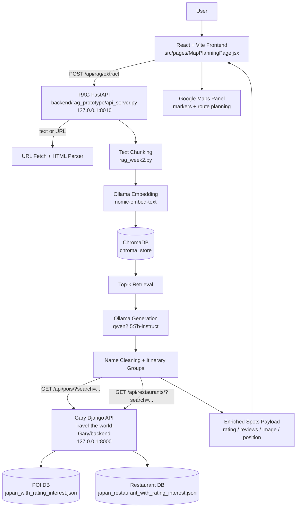

# Japan Travel Planning App

這個專案是一個日本旅遊行程規劃 Web App。前端使用 React + Vite，後端包含兩個服務：

- `backend/rag_prototype`：FastAPI + Ollama + ChromaDB，用來從旅遊文章或 URL 抽取景點 / 餐廳名稱。
- `Travel-the-world-Gary/backend`：Django REST Framework，提供日本景點 POI 與餐廳 POI 資料庫 API。

前端會呼叫 RAG API，RAG API 再串接 Gary 的 POI / Restaurant API，把抽取到的名稱補上評分、評論數、圖片、座標、分類與來源段落，最後在地圖規劃頁呈現。

## 系統架構



## 服務與 Port

| 服務 | 預設網址 | 主要用途 |
|---|---|---|
| Ollama | `http://127.0.0.1:11434` | Embedding 與生成模型 |
| Gary Django API | `http://127.0.0.1:8000` | 景點 POI、餐廳 POI、推薦 API |
| RAG FastAPI | `http://127.0.0.1:8010` | 文章抽取、RAG、POI enrich |
| Vite Frontend | `http://127.0.0.1:5173` | 使用者介面與地圖規劃 |

可直接執行根目錄的 `run_all.bat` 同時啟動三個本機服務。

## 專案結構

```text
Travel-the-world/
├─ src/
│  ├─ pages/MapPlanningPage.jsx          # 前端地圖規劃頁，呼叫 RAG API
│  └─ components/map/GoogleMapPanel.jsx  # Google Maps markers / route
├─ backend/rag_prototype/
│  ├─ api_server.py                      # FastAPI，RAG API 與 POI enrich
│  ├─ rag_week2.py                       # RAG 核心：chunking / embedding / retrieval / generation
│  ├─ eval_ragas.py                      # 評估腳本
│  ├─ eval_seed_questions.jsonl          # 景點測試資料
│  ├─ eval_seed_questions_restaurants.jsonl # 餐廳測試資料
│  └─ README.md                          # RAG 子系統詳細文件
├─ Travel-the-world-Gary/
│  ├─ backend/                           # Django REST Framework API
│  ├─ pipeline/                          # 景點資料處理
│  ├─ pipeline-restaurant/               # 餐廳資料處理
│  ├─ japan_with_rating_interest.json    # 景點資料
│  └─ japan_restaurant_with_rating_interest.json # 餐廳資料
├─ miscellaneous/
│  └─ 評價與優化建議.md
├─ run_all.bat                           # 同時啟動 Django API、RAG API、Frontend
├─ .env.example                          # 前端環境變數範例
└─ package.json
```

## 功能

- 支援直接貼上旅遊文章文字。
- 支援輸入旅遊文章 URL，由 RAG API 抓取並解析 HTML。
- 從文章中抽取景點、餐廳、咖啡店、甜點店等名稱。
- 使用 ChromaDB 做向量檢索，降低長文資訊遺漏。
- 使用 Gary Django API 補景點 POI 與餐廳 POI。
- 回傳 enriched spot payload，包含：
  - 名稱與匹配名稱
  - 地區
  - 評分
  - 評論數
  - tags
  - 座標
  - 圖片
  - 來源段落摘要
  - `poiMatch` / `restaurantMatch`
- 前端可依行程分組顯示景點，並加入地圖路線規劃。
- 提供景點與餐廳資料集的 evaluation runner。

## 安裝需求

- Node.js 18+
- Python 3.10+
- Ollama
- Google Maps JavaScript API Key
- Windows PowerShell / CMD 或等效 shell

## 前端設定

安裝 npm 套件：

```bash
npm install
```

建立根目錄 `.env`：

```bash
copy .env.example .env
```

`.env` 範例：

```env
VITE_GOOGLE_MAPS_API_KEY=your_google_maps_api_key
VITE_GOOGLE_MAP_ID=
VITE_RAG_API_BASE_URL=http://127.0.0.1:8010
```

啟動前端：

```bash
npm run dev
```

前端網址：

```text
http://127.0.0.1:5173
```

## Gary Django API 設定

Gary 子專案提供景點 POI 與餐廳 POI API。

```bash
cd Travel-the-world-Gary
python -m venv .venv
.venv\Scripts\activate
pip install -r requirements.txt
cd backend
python manage.py migrate
```

匯入景點資料：

```bash
python manage.py import_pois ../japan_with_rating_interest.json --replace
```

匯入餐廳資料：

```bash
python manage.py import_restaurants ../japan_restaurant_with_rating_interest.json --replace
```

啟動 Django API：

```bash
python manage.py runserver
```

預設網址：

```text
http://127.0.0.1:8000
```

重要 API：

```text
GET /api/pois/
GET /api/pois/{poi_id}/
GET /api/metadata/

GET /api/restaurants/
GET /api/restaurants/{restaurant_id}/
GET /api/restaurants/metadata/
POST /api/restaurants/recommendations/
```

RAG API 目前主要使用：

```text
GET /api/pois/?search={name}&page_size=20
GET /api/restaurants/?search={name}&page_size=20
```

## RAG API 設定

建立 Python 環境：

```bash
cd backend/rag_prototype
python -m venv .venv
.venv\Scripts\activate
pip install -r requirements.txt
```

安裝 Ollama 模型：

```bash
ollama pull nomic-embed-text
ollama pull qwen2.5:7b-instruct
```

`backend/rag_prototype/.env` 可設定：

```env
OLLAMA_BASE_URL=http://127.0.0.1:11434
OLLAMA_EMBED_MODEL=nomic-embed-text
OLLAMA_GEN_MODEL=qwen2.5:7b-instruct

RAG_CHROMA_DIR=./chroma_store
RAG_COLLECTION_NAME=japan_guides_week2
RAG_MAX_CHUNKS_PER_PROMPT=10

POI_API_BASE_URL=http://127.0.0.1:8000
POI_LOOKUP_PAGE_SIZE=20
POI_LOOKUP_TIMEOUT_SECONDS=5
POI_LOOKUP_MAX_QUERIES=18
```

啟動 RAG API：

```bash
cd backend/rag_prototype
.venv\Scripts\activate
uvicorn api_server:app --host 127.0.0.1 --port 8010 --reload
```

健康檢查：

```text
GET http://127.0.0.1:8010/health
```


## RAG Extract API

Endpoint：

```text
POST http://127.0.0.1:8010/api/rag/extract
```

Request body：

```json
{
  "text": "東京三日行程：DAY1 去淺草寺，中午吃淺草今半，晚上去東京晴空塔。",
  "url": "",
  "query": "請列出文章中的旅遊景點與餐廳名稱",
  "top_k": 4,
  "reset_db": false,
  "debug": true
}
```

Response 主要欄位：

- `spot_names`：抽取出的景點 / 餐廳名稱。
- `spots`：已補 Gary POI / Restaurant 資料的完整卡片資料。
- `itinerary_groups`：依 DAY 或段落建立的行程分組。
- `retrieved_chunk_indices`：RAG 檢索到的 chunk 編號。
- `embed_model` / `gen_model`：實際使用的 Ollama 模型。
- `generation_warning`：fallback 或模型警告。
- `debug_metrics`：chunk 數、匹配數、餐廳命中數等。
- `debug_samples`：被濾掉的名稱或分組樣本。

`spots[]` 會包含：

- `name`
- `matchedName`
- `area`
- `rating`
- `reviewsCount`
- `tags`
- `position`
- `imageUrl`
- `sourceExcerpt`
- `matchSourceType`
- `poiMatch`
- `restaurantMatch`
- `poi`
- `restaurant`

## 餐廳 POI 串接

RAG API 會優先查 Gary 的 restaurant endpoint：

```text
GET /api/restaurants/?search={query}&page_size=20
```

若查不到，再退回一般 POI：

```text
GET /api/pois/?search={query}&page_size=20
```

餐廳名稱會做 query 補強，例如：

- `一蘭拉麵新宿中央東口店` -> `一蘭`、`一蘭 新宿中央東口店`
- `淺草今半國際通本店` -> `浅草今半`
- `山本屋總本家本家` -> `山本屋総本家`
- `CoCo壱番屋浪速区難波中一丁目店` -> `CoCo壱番屋`

命中後：

- `matchSourceType: "restaurant"` 表示餐廳資料庫命中。
- `matchSourceType: "poi"` 表示一般 POI 資料庫命中。
- `restaurantMatch.matched` 可用來判斷是否為餐廳命中。

## Evaluation

RAG 評估腳本：

```text
backend/rag_prototype/eval_ragas.py
```

一般景點資料集：

```text
backend/rag_prototype/eval_seed_questions.jsonl
```

餐廳測試資料集：

```text
backend/rag_prototype/eval_seed_questions_restaurants.jsonl
```

執行一般景點評估：

```bash
cd backend/rag_prototype
.venv\Scripts\activate
python eval_ragas.py --dataset eval_seed_questions.jsonl --api-base http://127.0.0.1:8010 --debug
```

執行餐廳 POI 評估：

```bash
python eval_ragas.py --dataset eval_seed_questions_restaurants.jsonl --api-base http://127.0.0.1:8010 --debug
```

輸出：

```text
backend/rag_prototype/eval_outputs/rag_eval_samples_*.jsonl
backend/rag_prototype/eval_outputs/rag_eval_summary_*.json
```

餐廳第二次測試結果摘要：

- `poi_match_rate`: 約 `0.9474`
- `poi_matched_count`: `72 / 76`
- `sample_full_match_count`: `17 / 20`
- `sample_any_match_count`: `20 / 20`
- `poi_integration_score`: 約 `0.8873`

剩餘主要問題：

- 少數餐廳資料庫沒有資料。
- 少數日文片假名餐廳名會被模型音譯或轉壞。
- 餐廳評估中偶爾會混入非餐廳景點，需要更嚴格的餐廳抽取 prompt 或後處理。

## Troubleshooting

### RAG API 連不上 Gary POI

確認 Django API 有啟動：

```text
http://127.0.0.1:8000/api/pois/?search=東京&page_size=5
http://127.0.0.1:8000/api/restaurants/?search=一蘭&page_size=5
```

確認 RAG `.env`：

```env
POI_API_BASE_URL=http://127.0.0.1:8000
```

### 前端連不到 RAG API

確認根目錄 `.env`：

```env
VITE_RAG_API_BASE_URL=http://127.0.0.1:8010
```

修改 `.env` 後需要重啟 Vite。

### Ollama 無法產生 embedding 或回答

確認 Ollama 服務與模型：

```bash
ollama list
ollama pull nomic-embed-text
ollama pull qwen2.5:7b-instruct
```

### Google Maps 無法顯示

確認：

- `VITE_GOOGLE_MAPS_API_KEY`
- Google Maps JavaScript API 是否啟用
- Billing / referrer restriction 設定是否正確

若 Directions API 無法使用，前端仍會 fallback 到 Google Maps URL。

