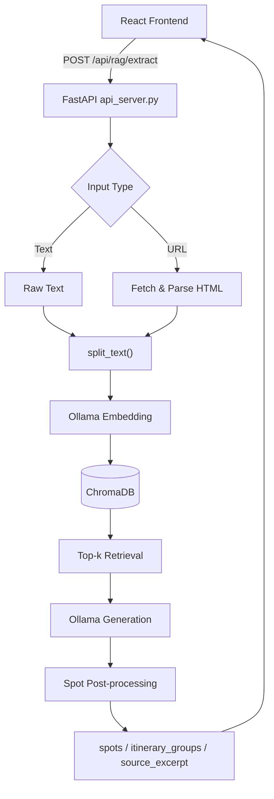

# Japan Travel Planning App

以 **React + FastAPI + Ollama + ChromaDB** 建構的日本旅遊規劃系統。  
本專案的核心是 RAG（Retrieval-Augmented Generation）流程：輸入攻略文字或攻略 URL，萃取景點、保留來源片段、分組行程，並同步到地圖與互動式 UI。

---

## 1. 專案目標

- 將旅遊攻略（文字/網址）轉成可操作的景點清單
- 提供來源片段（explainable）以利驗證
- 支援加入行程、移除行程、地圖互動展示
- 在 API/模型異常時具備 fallback（可 demo）

---

## 2. 主要功能

- 攻略輸入模式：
  - 貼上文字
  - 貼上 URL（後端抓全文並清洗）
- RAG 萃取：
  - chunking
  - embedding（Ollama）
  - vector retrieval（ChromaDB）
  - 生成景點名稱（Ollama）
  - 景點清洗/去重/分組
- 前端互動：
  - 景點卡片
  - 行程加入/移除
  - Google Maps marker 與路線展示
- 穩定性設計：
  - embedding/generation 模型 fallback
  - Directions API 被拒時，自動 fallback 至 Google Maps URL 導航

---

## 3. 系統架構



---

## 4. 專案結構

```text
project/
├─ src/                              # React 前端
│  ├─ pages/MapPlanningPage.jsx      # 主頁面（輸入、萃取結果、行程）
│  ├─ components/map/GoogleMapPanel.jsx
│  └─ lib/googleMapsLoader.js
├─ backend/rag_prototype/            # FastAPI + RAG prototype
│  ├─ api_server.py                  # API 入口
│  ├─ rag_week2.py                   # RAG 核心流程
│  ├─ requirements.txt
│  └─ .env.example
├─ .env.example                      # 前端環境變數範本
├─ package.json
└─ README.md
```

---

## 5. 環境需求

- Node.js 18+
- Python 3.10+
- Ollama（本機執行）
- Google Maps JavaScript API Key（前端地圖）

---

## 6. 安裝與設定

### 6.1 前端設定

1. 安裝依賴

```bash
npm install
```

2. 建立前端環境變數

```bash
cp .env.example .env
```

`.env`（根目錄）範例：

```env
VITE_GOOGLE_MAPS_API_KEY=your_google_maps_api_key
VITE_GOOGLE_MAP_ID=
VITE_RAG_API_BASE_URL=http://127.0.0.1:8010
```

---

### 6.2 後端設定（RAG）

1. 進入後端資料夾並建立虛擬環境

```bash
cd backend/rag_prototype
python -m venv .venv
.venv\Scripts\activate
pip install -r requirements.txt
```

2. 建立後端環境變數

```bash
cp .env.example .env
```

`backend/rag_prototype/.env` 範例：

```env
OLLAMA_BASE_URL=http://127.0.0.1:11434
OLLAMA_EMBED_MODEL=nomic-embed-text
OLLAMA_GEN_MODEL=qwen2.5:7b-instruct
RAG_CHROMA_DIR=./chroma_store
RAG_COLLECTION_NAME=japan_guides_week2
```

3. 下載 Ollama 模型（至少 1 組 embedding + 1 組 generation）

```bash
ollama pull nomic-embed-text
ollama pull qwen2.5:7b-instruct
```

---

## 7. 啟動方式

### 7.1 啟動後端 API

```bash
cd backend/rag_prototype
.venv\Scripts\activate
uvicorn api_server:app --host 127.0.0.1 --port 8010 --reload
```

### 7.2 啟動前端

```bash
npm run dev
```

預設前端網址：`http://localhost:5173`

---

## 8. API 規格

### `GET /health`

檢查 API 與 Ollama 狀態。

### `POST /api/rag/extract`

Request body：

```json
{
  "text": "旅遊攻略全文（可空）",
  "url": "https://example.com/guide（可空）",
  "query": "請列出文章中的旅遊景點名稱",
  "top_k": 4,
  "reset_db": false,
  "debug": true
}
```

Response 重點欄位：

- `spot_names`
- `spots[]`（含 `source_chunk_index`, `source_excerpt`, `source_text`）
- `itinerary_groups[]`
- `embed_model`, `gen_model`
- `debug_metrics`, `debug_samples`

---

## 9. Demo 使用流程

1. 開啟前端頁面
2. 貼上攻略文字或攻略 URL
3. 點擊「驗證萃取景點」
4. 在萃取結果選擇景點，加入行程
5. 觀察地圖 marker 與路線（或 fallback 導航連結）

---

## 10. 常見問題（Troubleshooting）

### 1) Google Maps `InvalidKeyMapError`
- API Key 無效、限制錯誤，或未啟用對應服務
- 檢查 `.env` 的 `VITE_GOOGLE_MAPS_API_KEY`

### 2) `REQUEST_DENIED` / `LegacyApiNotActivatedMapError`
- 未啟用舊版 Directions API 時，內建路線可能失敗
- 專案已提供 Google Maps URL fallback，可直接導航

### 3) URL 可萃取，但 text 模式結果混入舊文章
- 已修正為每次索引前清空 collection 既有 ids，避免舊向量污染

### 4) `mapsjs/gen_204` blocked
- 常見於 AdBlock 或隱私擴充套件
- 可改用無痕/停用擴充套件測試

---

## 11. 開發里程碑（對照規劃文件）

- Week 1：RAG 架構調研 + React UI 雛型
- Week 2：Google Maps 串接 + 基礎 RAG prototype
- Week 3：URL 解析、行程分組、來源片段追蹤、路線 fallback
- Week 4+：品質優化（抽取準確率、分組穩定性、評測與快取）

